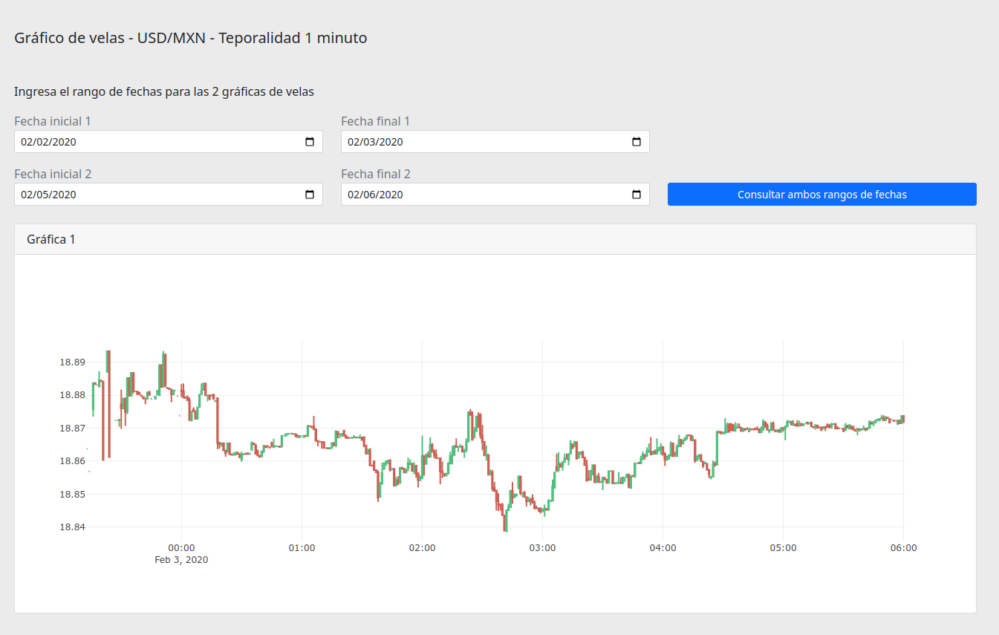

# Dashboard y API del histórico de precios para el par USD/MXN


El dashboard es una herramienta visual que muestra el histórico de precios minuto a minuto del par USD/MXN. Comunmente es utilizado para crear estrategias basadas en patrones de velas.

La API ofrece los datos en formato JSON del histórico de precios minuto a minuto del par USD/MXN. Comunmente es utilizado para hacer estrategias de trading cuantitativo.

# Instalación

## Requisitos

Al menos tener instalado o configurado en el equipo de desarrollo:

- Node.js v16.x
- Un servidor para MySQL
- Permisos en el equipo para instalar programas si es necesario

## Importar la base de datos

- Cree una base de datos con el nombre `forex`
- Importe las tablas y datos del archivo `doc/dump-forex-10-08-2022-10.08.sql`

## Configurar la conexión a la base de datos

En la raíz del proyecto genere un archivo con nombre `.env` y pegue el siguiente contenido:

```
DATABASE=forex
HOST=127.0.0.1
PASSWORD=
DB_PORT=3306
DB_USER=root

ENV=development
PORT=3000
BASE_URL=http://localhost:${PORT}/
```

Configure los datos si es necesario.

## Instalar las dependencias

Las dependencias utilizadas se encuentran en [package.json](package.json), para instalarlas ejecute en la terminal lo siguiente:

```
npm install
```

## Iniciar el proyecto para el desarrollo

En al terminal ejecute

```
npm run dev
```

## Iniciar el proyecto en modo de producción

En al terminal ejecute

```
npm run start
```
